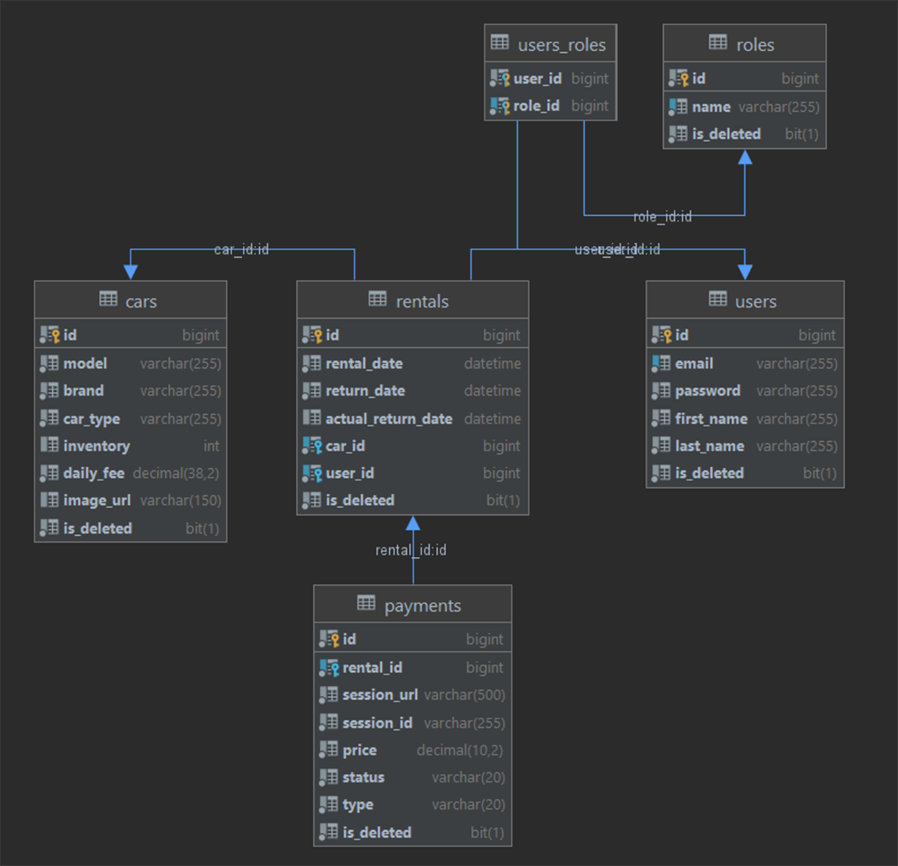

<h1 align="center">Car Sharing App</h1>

___
<h3>
<p align="center" id="home">
  <a href="#introduction" style="color: #ac4400">Introduction</a> -
  <a href="#technologies" style="color: #ac4400">Technologies</a> -
  <a href="#models" style="color: #ac4400">Models</a> -
  <a href="#how-to-run" style="color: #ac4400">How run this project</a> -
  <a href="#project-architecture" style="color: #ac4400">Project architecture</a> -
  <a href="#database-structure" style="color: #ac4400">Database structure</a> -
  <a href="#controllers" style="color: #ac4400">Controllers</a>
</p>
</h3>

___
<h2 id="introduction"> Introduction</h2>

Car Sharing Service App is a car rental application with JWT authorization to secure access to the application. Users
are divided into managers and clients to separate rights in the application. Notifications that a rental has been
created, paid or expired are sent to the user via a Telegram bot. They can be adjusted at the discretion of the
application administrator. Stripe API was used as a payment system. Payments are secure and if there is an error the
transaction will be cancelled.


---
<h2 id="technologies"> Technologies </h2>

- Java 17
- Spring Boot, Spring Security, Spring data JPA
- MySQL, Liquibase, Hibernate
- REST, Mapstruct
- Maven, Docker
- Lombok, Swagger
- Junit, Mockito, testcontainers
- Telegram API
- Stripe API


---

<h2 id="models"> Models </h2>

### Car:

The Car model is a structured representation of a vehicle available in a car sharing service, encompassing key
attributes for effective management and user interaction. <br>
It includes the following attributes:
<details>

* Model: A distinctive identifier denoting the specific name or label of the car model.
* Brand: The brand or manufacturer responsible for producing the car, providing insight into its origin.
* Type: An enumeration capturing the body type of the car. It can take values from the set {SEDAN, SUV, HATCHBACK,
  UNIVERSAL}, elucidating the vehicle's structural category.
* Inventory: An integer reflecting the current availability of this particular car within the car sharing service. This
  attribute aids in real-time tracking of the car's stock.
* Daily Fee: A decimal value in $USD, indicating the cost users incur per day when renting this car. This information
  facilitates transparent pricing for potential renters.
* Image URL: A string representing a URL pointing to an image of the car. This visual aid allows users to preview the
  car's appearance before making a rental selection.

</details>

### User (Customer):

This model is a basic representation of customer information and is commonly used in user management systems for
applications. The password field is securely hashed and stored. <br>
It includes the following attributes:
<details>

* Email: String, representing the user's email address.
* First name: String, representing the user's first name.
* Last name: String, representing the user's last name.
* Password: String, representing the user's password.

</details>

### Role

Provides the possible roles, including CUSTOMER and MANAGER. This model is commonly used for managing user roles and
permissions.
<details>

* CUSTOMER - default role for all registered users
* MANAGER - with this role you can manage cars and rentals

</details>

### Rental

The Rental model encapsulates information related to a car rental transaction. <br>
It includes the following attributes:
<details>

* Rental date: Represents the date when the car was rented.
* Return date: Signifies the expected date for the car to be returned.
* Actual return date: Records the actual date when the car was returned.
* Car ID: A unique identifier associated with the specific car involved in the rental.
* User ID: A unique identifier corresponding to the user who initiated the rental.

</details>

### Payment:

The Payment model represents a financial transaction. <br>
It encompasses the following attributes:
<details>

* Status: An enumeration with possible values PENDING, PAID or CANCELED, indicating the current status of the payment.
* Type: An enumeration with possible values PAYMENT or FINE, specifying whether the transaction is related to a regular
  payment or a fine.
* Rental: A unique identifier associated with the specific car rental to which the payment or fine is related.
* Session URL: A URL pointing to the payment session with a stripe, facilitating online payment processing.
* Session ID: A String representing the unique identifier of the payment session.
* Amount to Pay: A decimal value (in $USD) representing the calculated total price for the rental or fine.

</details>

<p align="right" id="home"> <a href="#introduction" style="color: #418739">back to menu</a> </p>

---
<h2 id="how-to-run"> How run this project</h2>

1. Make sure you have installed next tools

 <li> JDK 17+</li>
 <li> <a href="https://www.docker.com/">Docker</a></li>

2. Clone project

```text
git clone https://github.com/andrey-kiyas/CarSharingService
```

3. Create `.env` file in the root of project and populate variables from `.env.sample` file

4. Run the following command to build and start the Docker containers

```
docker-compose up --build
```

5. The application should now be running at http://localhost:8081.

<p align="right" id="home"> <a href="#introduction" style="color: #418739">back to menu</a> </p>

---
<h2 id="project-architecture">Project architecture</h2>


<p align="right" id="home"> <a href="#introduction" style="color: #418739">back to menu</a> </p>

---
<h2 id="database-structure">Database structure</h2>



<p align="right" id="home"> <a href="#introduction" style="color: #418739">back to menu</a> </p>

---
<h2 id="controllers">Controllers and endpoints available</h2>

Unauthorized customers can access endpoints to see all cars or info on one certain car. After registration and login
customer can create a new rental, see info on their rental history, and pay for rental. Manager can modify data: add a
new car, update info on an existing one, update customer's role.

### **Authentication Controller:**

| **HTTP method** |      **Endpoint**      | **Role** | **Function**                                   |
|:---------------:|:----------------------:|:--------:|:-----------------------------------------------|
|      POST       | /api/auth/registration |   ALL    | Allows a new customer to register              |
|      POST       |    /api/auth/login     |   ALL    | Authenticates a customer and returns JWT token |

---

### **User Controller:** _Updating and getting user info_

| **HTTP method** |     **Endpoint**     | **Role** | **Function**                                             |
|:---------------:|:--------------------:|:--------:|:---------------------------------------------------------|
|       GET       |    /api/users/me     | CUSTOMER | Enables customers to get info about themselves           |
|      PATCH      |  /api/users/update   | CUSTOMER | Enables customers to update their firstname and lastname |
|       PUT       | /api/users/{id}/role | MANAGER  | Enables managers to update user's role                   |

---

### **Car Controller:** _Managing and browsing cars_

| **HTTP method** |     **Endpoint**      | **Role** | **Function**                                                  |
|:---------------:|:---------------------:|:--------:|:--------------------------------------------------------------|
|       GET       |       /api/cars       |   ALL    | Enables even unauthorized users to get all cars               |
|       GET       |    /api/cars/{id}     |   ALL    | Enables even unauthorized users to get info on a specific car |
|      POST       |       /api/cars       | MANAGER  | Enables manager to add a new car to DB                        |
|       PUT       |    /api/cars/{id}     | MANAGER  | Enables managers to update info on an existing in DB car      |
|     DELETE      | /api/categories/{id}  | MANAGER  | Enables managers to delete a car from DB                      |

---

### **Payment Controller:** _Managing and browsing payments_

| **HTTP method** |         **Endpoint**          | **Role** | **
Function**                                                                  |
|:---------------:|:-----------------------------:|:--------:|:------------------------------------------------------------------------------|
|       GET       |         /api/payments         | CUSTOMER | Enables customers to get all their payments                                   |
|       GET       | /api/payments/search/?status= | CUSTOMER | Enables customers to get all their payments by status (PAID/PENDING/CANCELED) |
|      POST       |       /api/payments/pay       | CUSTOMER | Enables customers to create session to use Stripe                             |

---

### **Rental Controller:** _Managing and browsing rentals_

| **HTTP method** |               **Endpoint**               | **Role** | **
Function**                                                          |
|:---------------:|:----------------------------------------:|:--------:|:----------------------------------------------------------------------|
|      POST       |               /api/rentals               | CUSTOMER | Enables customers to create new rental                                |
|       GET       |               /api/rentals               | CUSTOMER | Enables customers to get all their rentals                            |
|       GET       |         /api/rentals/?is_active=         | CUSTOMER | Enables customers to get all their rentals by activeness (true/false) |
|       GET       | /api/rentals/search/?user_id=&is_active= | MANAGER  | Enables managers to search rentals using userId and activeness        |
|      POST       |         /api/rentals/{id}/return         | MANAGER  | Enables managers to return rental by setting actual return date       |

<p align="right" id="home"> <a href="#introduction" style="color: #418739">back to menu</a> </p>


